# STM32 系列 BSP 制作教程

为了让广大开发者更好、更方便地使用 BSP 进行开发，RT-Thread 开发团队重新整理了现有的 STM32 系列的 BSP，推出了新的 BSP 框架。新的 BSP 框架在易用性、移植便利性、驱动完整性、代码规范性等方面都有较大提升，在新的 BSP 框架下进行开发，可以大大提高应用的开发效率。

和 RT-Thread 以往提供的 BSP 不同，在新的 BSP 文件夹中将不会包含固件库、外设驱动等可以被多个 BSP 引用的代码文件。而是将这些通用的文件统一存放在 Library 文件夹中，通过在特定 BSP 中引用这些文件的方式，来包含 BSP 中所需的库文件或者驱动文件。这种方式不仅大大提高了代码复用率，降低了 BSP 的维护成本，而且可以更方便地给开发者提供更丰富的驱动文件，让开发者可以更容易地找到自己需要的资源。

新的 BSP 框架还引入了 CubeMX 工具，可以使用该工具来对 BSP 中使用的外设引脚进行配置。CubeMX 工具提供了图形化的配置界面，这种图形化的配置方式对开发者来说更加直观，不仅可以让开发者灵活地配置 BSP 中使用的资源，并且可以让开发者对资源的使用情况一目了然。

新 BSP 框架的主要特性如下：

- 提供多系列 BSP 模板，大大降低新 BSP 的添加难度；
- 每个 BSP 都配有齐全的驱动文件，开发者可以方便地使用所有驱动；
- 开发者可以使用 CubeMX 工具对 BSP 进行图形化配置；

## 1. BSP 框架介绍 

BSP 框架结构如下图所示：

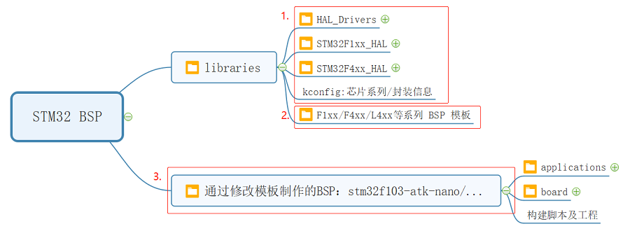

每一个 STM32 系列的 BSP 由三部分组成，分别是通用库、BSP 模板和特定开发板 BSP，下面的表格以 F1 系列 BSP 为例介绍这三个部分：

|项目|文件夹|说明|
| - | - | :-- |
| 通用库 | stm32/libraries | 用于存放 HAL 库以及基于 HAL 库的多系列通用外设驱动文件 |
| F1 系列 BSP 工程模板 | stm32/libraries/templates/stm32f10x | F1系列 BSP 模板，可以通过修改该模板制作更多 F1系列 BSP |
| 特定开发板 BSP | stm32/stm32f103-atk-nano | 在 BSP 模板的基础上修改而成 |

## 2. 知识准备

制作一个 BSP 的过程就是构建一个新系统的过程，因此想要制作出好用的 BSP，要对 RT-Thread 系统的构建过程有一定了解，需要的知识准备如下所示：

- 掌握  stm32 系列 BSP 的使用方法

  了解 BSP 的使用方法，可以阅读 [BSP 说明文档](../README.md) 中使用教程表格内的文档。了解外设驱动的添加方法可以参考《外设驱动添加指南》。

- 了解 scons 工程构建方法

  RT-Thread 使用 scons 作为系统的构建工具，因此了解 scons 的常用命令对制作新 BSP 是基本要求。

- 了解设备驱动框架

  在 RT-Thread 系统中，应用程序通过设备驱动框架来操作硬件，因此了解设备驱动框架，对添加 BSP 驱动是很重要的。

- 了解 kconfig 语法

  RT-Thread 系统通过 menuconfig 的方式进行配置，而 menuconfig 中的选项是由 kconfig 文件决定的，因此想要对 RT-Thread 系统进行配置，需要对 kconfig 语法有一定了解。

- 熟悉 CubeMX 工具的使用

  在新的 stm32 系列 BSP 中利用了 CubeMX 工具对底层硬件进行配置，因此需要了解 CubeMX 工具的使用方法。

## 3. BSP 制作方法

本节以制作正点原子 `stm32f103-atk-nano` 开发板的 BSP 为例，讲解如何为一个新的开发板添加 BSP。

BSP 的制作过程分为如下五个步骤：

1. 复制通用模板
2. 使用 CubeMX 工具配置工程
3. 修改 BSP 中的 Kconfig 文件
4. 修改构建工程相关文件
5. 重新生成工程

在接下来的章节中将会详细介绍这五个步骤，帮助开发者快速创建所需要的 BSP。

### 3.1 复制通用模板
制作新 BSP 的第一步是复制一份同系列的 BSP 模板作为基础，通过对 BSP 模板的修改来获得新 BSP。目前提供的 BSP 模板系列如下表所示：

| 工程模板 | 说明 |
| ------- | ---- |
| libraries/templates/stm32f0xx | F0 系列 BSP 模板 |
| libraries/templates/stm32f10x | F1 系列 BSP 模板 |
| libraries/templates/stm32f4xx | F4 系列 BSP 模板 |
| libraries/templates/stm32f7xx | F7 系列 BSP 模板 |
| libraries/templates/stm32l4xx | L4 系列 BSP 模板 |

本次示例所用的 F1 系列 BSP 模板文件夹结构如下所示：

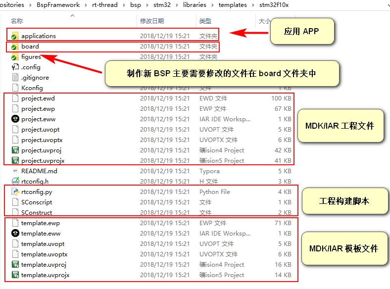

本次制作的 BSP 为 F1 系列，因此拷贝模板文件夹下的 `stm32f10x` 文件夹，并将该文件夹的名称改为 `stm32f103-atk-nano` ，如下图所示：

在接下来的 BSP 的制作过程中，将会修改 board 文件夹内的配置文件，将 F1 系列的 BSP 模板变成一个适用于正点原子 `stm32f103-atk-nano` 开发板的 BSP ，下表总结了 board 文件夹中需要修改的内容：

| 项目 | 需要修改的内容说明 |
|-------------|-------------------------------------------------------|
| CubeMX_Config （文件夹）| CubeMX 工程 |
| linker_scripts （文件夹）| BSP 特定的链接脚本 |
|board.c/h | 系统时钟、GPIO 初始化函数、芯片存储器大小 |
| Kconfig | 芯片型号、系列、外设资源 |
| SConscript | 芯片启动文件、目标芯片型号 |

### 3.2 使用 CubeMX 配置工程

在制作 BSP 的第二步，需要创建一个基于目标芯片的 CubeMX 工程。默认的 CubeMX 工程在 **CubeMX_Config** 文件夹中，双击打开 `CubeMX_Config.ioc` 工程，如下图所示：

在 CubeMX 工程中将芯片型号为修改芯片型号为 STM32F103RBTx 。

#### 3.2.1 生成 CubeMX 工程

配置系统时钟、外设引脚等，步骤如下图所示：

1. 打开外部时钟、设置下载方式、打开串口外设（注意只需要选择串口外设引脚即可，无需配置其他参数）：

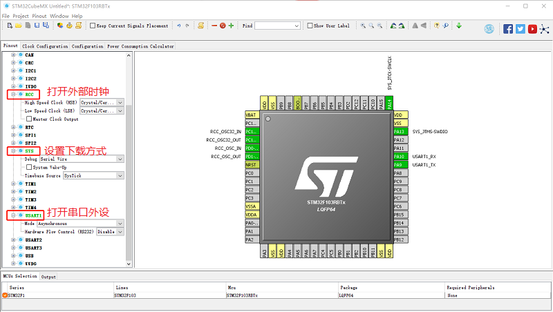

2. 配置系统时钟：

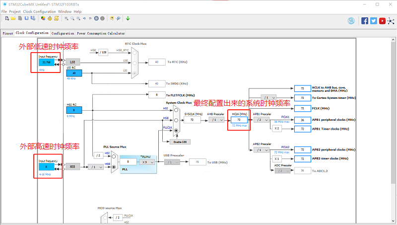

3. 设置项目名称，并在指定地址重新生成 CubeMX 工程：

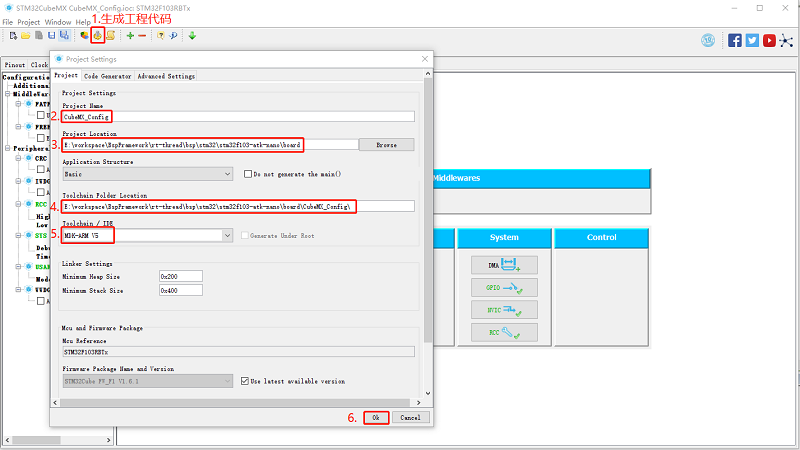

最终 CubeMX 生成的工程目录结构如下图所示：

#### 3.2.2 拷贝初始化函数

在 **board.c** 文件中存放了函数 `SystemClock_Config()` ，该函数负责初始化系统时钟。当使用 CubeMX 工具对系统时钟重新配置的时候，需要更新这个函数。

该函数由 CubeMX 工具生成，默认存放在`board/CubeMX_Config/Src/main.c` 文件中。但是该文件并没有被包含到我们的工程中，因此需要将这个函数从 main.c 中拷贝到 board.c 文件中。在整个 BSP 的制作过程中，这个函数是唯一要要拷贝的函数，该函数内容如下所示：

在 **board.h** 文件中配置了 FLASH 和 RAM 的相关参数，这个文件中需要修改的是 `STM32_FLASH_SIZE` 和 `STM32_SRAM_SIZE` 这两个宏控制的参数。本次制作的 BSP 所用的 STM32F103RBTx 芯片的 flash 大小为 128k，ram 的大小为 20k，因此对该文件作出如下的修改：

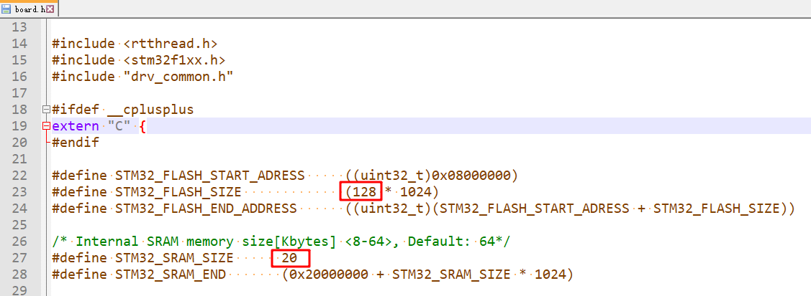

### 3.3 修改 Kconfig 选项

在本小节中修改 `board/Kconfig` 文件的内容有如下两点：

- 芯片型号和系列
- BSP 上的外设支持选项

芯片型号和系列的修改如下表所示：

| 宏定义             | 意义     | 格式               |
| ------------------ | -------- | ------------------ |
| SOC_STM32F103RB    | 芯片型号 | SOC_STM32xxx       |
| SOC_SERIES_STM32F1 | 芯片系列 | SOC_SERIES_STM32xx |

关于 BSP 上的外设支持选项，一个初次提交的 BSP 仅仅需要支持 GPIO 驱动和串口驱动即可，因此在配置选项中只需保留这两个驱动配置项，如下图所示：

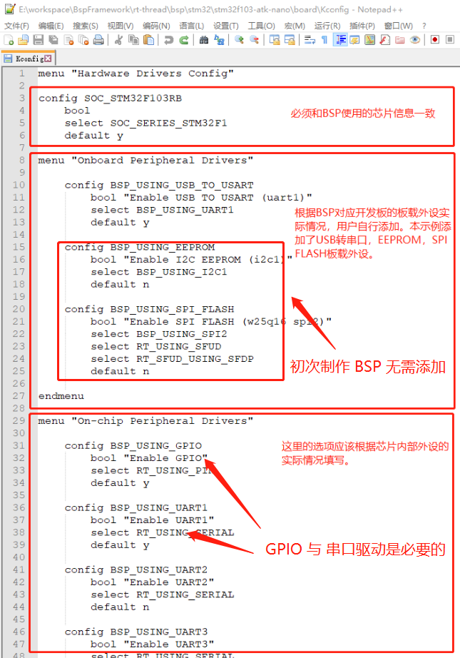

### 3.4 修改工程构建相关文件
接下来需要修改用于构建工程相关的文件。

#### 3.4.1 修改链接脚本
**linker_scripts** 链接文件如下图所示：

下面以 MDK 使用的链接脚本 link.sct 为例，演示如何修改链接脚本：

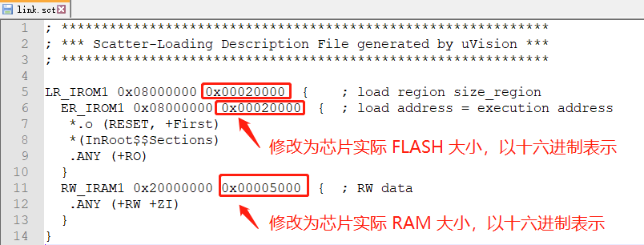

本次制作 BSP 使用的芯片为 STM32F103RB，FLASH 为 128k，因此修改 LR_IROM1 和 ER_IROM1 的参数为 0x00020000。RAM 的大小为20k， 因此修改 RW_IRAM1 的参数为 0x00005000。这样的修改方式在一般的应用下就够用了，后续如果有特殊要求，则需要按照链接脚本的语法来根据需求修改。

其他两个链接脚本的文件分别为 iar 使用的 link.icf 和 gcc 编译器使用的 link.lds，修改的方式也是类似的，如下图所示：

- link.icf 修改内容

  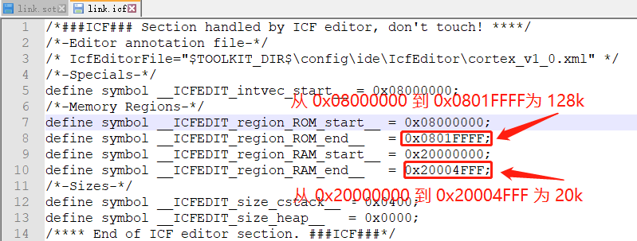

- link.lds 修改内容

  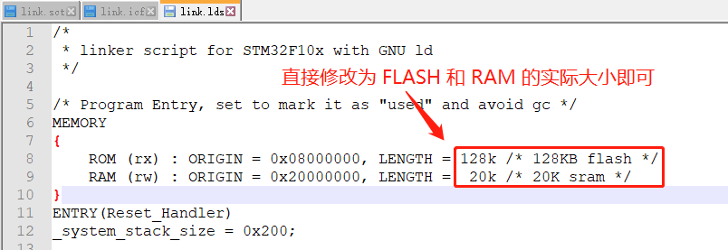

####  3.4.2 修改构建脚本

**SConscript** 脚本决定 MDK/IAR 工程的生成以及编译过程中要添加文件。

在这一步中需要修改芯片型号以及芯片启动文件的地址，修改内容如下图所示：

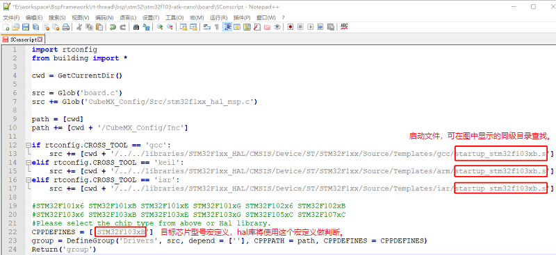

注意：如果在文件夹中找不到相应系列的 .s 文件，可能是多个系列的芯片重用了相同的启动文件，此时可以在 CubeMX 中生成目标芯片的工程，查看使用了哪个启动文件，然后再修改启动文件名。

#### 3.4.3 修改工程模板

**template** 文件是生成 MDK/IAR 工程的模板文件，通过修改该文件可以设置工程中使用的芯片型号以及下载方式。MDK4/MDK5/IAR 的工程模板文件，如下图所示：

下面以 MDK5 模板的修改为例，介绍如何修改模板配置：

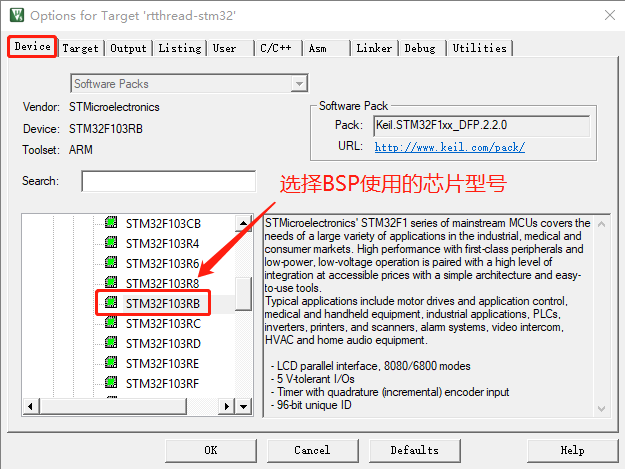

修改程序下载方式：

### 3.5 重新生成工程

重新生成工程需要使用 env 工具。

#### 3.5.1 重新生成 rtconfig.h 文件

在 env 界面输入命令 menuconfig 对工程进行配置，并生成新的 rtconfig.h 文件。如下图所示：

#### 3.5.2 重新 MDK/IAR 工程
下面以重新生成 MDK 工程为例，介绍如何重新生成 BSP 工程。

使用 env 工具输入命令 `scons --target=mdk5` 重新生成工程，如下图所示：

重新生成工程成功：

到这一步为止，新的 BSP 就可以使用了。

接下来我们可以分别使用命令 `scons --target=mdk4` 和 `scons --target=iar`，来更新 mdk4 和 iar 的工程，使得该 BSP 变成一个完整的，可以提交到 GitHub 的 BSP。

感谢每一位贡献代码的开发者，RT-Thread 将与你一同成长。

## 4. 规范

本章节介绍 RT-Thread STM32 系列 BSP 制作与提交时应当遵守的规范 。开发人员在 BSP 制作完成后，可以根据本规范提出的检查点对制作的 BSP 进行检查，确保 BSP 在提交前有较高的质量 。

### 1. BSP 制作规范

STM32 BSP 的制作规范主要分为 3 个方面：工程配置，ENV 配置和 IDE 配置。在已有的 STM32 系列 BSP 的模板中，已经根据下列规范对模板进行配置。在制作新 BSP 的过程中，拷贝模板进行修改时，需要注意的是不要修改这些默认的配置。BSP 制作完成后，需要对新制作的 BSP 进行功能测试，功能正常后再进行代码提交。

下面将详细介绍 BSP 的制作规范。

#### 工程配置

- 遵从RT-Thread 编码规范，代码注释风格统一
- main 函数功能保持一致
  - 如果有 LED 的话，main 函数里**只放一个**  LED 1HZ 闪烁的程序
- 在 `rt_hw_board_init` 中需要完成堆的初始化：调用 `rt_system_heap_init`
- 默认只初始化 GPIO 驱动和 FinSH 对应的串口驱动，不使用 DMA
- 当使能板载外设驱动时，应做到不需要修改代码就能编译下载使用
- 提交前应检查 gcc/mdk/iar 三种编译器直接编译或者重新生成后编译是否成功
- 使用 dist 功能对 BSP 进行发布，检查使用 dist 命令生成的工程是否可以正常使用

#### ENV 配置

- 系统心跳统一设置为 1000（宏：RT_TICK_PER_SECOND）
- BSP 中需要打开调试选项中的断言（宏：RT_DEBUG）
- 系统空闲线程栈大小统一设置为 256（宏：IDLE_THREAD_STACK_SIZE）
- 开启组件自动初始化（宏：RT_USING_COMPONENTS_INIT）
- 需要开启 user main 选项（宏：RT_USING_USER_MAIN）
- 默认关闭 libc（宏：RT_USING_LIBC）
- FinSH 默认只使用 MSH 模式（宏：FINSH_USING_MSH_ONLY）

#### IDE 配置

- 使能下载代码后自动运行
- 使能 C99 支持
- 使能 One ELF Setion per Function（MDK）
- keil/iar 生成的临时文件分别放到build下的 keil/iar 文件夹下
- mdk/gcc/iar 生成 bin 文件名字统一成 rtthread.bin

### 2. BSP 提交规范

- 提交前请认真修改 BSP 的 README.md 文件，README.md 文件的外设支持表单只填写 BSP 支持的外设，可参考其他 BSP 填写。查看文档[《STM32系列驱动介绍》](./STM32系列驱动介绍.md)了解驱动分类。
- 提交 BSP 分为 2 个阶段提交：
  - 第一阶段：基础 BSP 包括串口驱动和 GPIO 驱动，能运行 FinSH 控制台。完成 MDK4、MDK5 、IAR 和 GCC 编译器支持，如果芯片不支持某款编译器（比如MDK4）可以不用做。 BSP 的 README.md 文件需要填写第二阶段要完成的驱动。
  - 第二阶段：完成板载外设驱动支持，所有板载外设使用 menuconfig 配置后就能直接使用。若开发板没有板载外设，则此阶段可以不用完成。不同的驱动也要分开提交，方便 review 和合并。
- 只提交 BSP 必要的文件，删除无关的中间文件，能够提交的文件请对照其他 BSP。
- 提交 stm32 不同系列的 Library 库时，请参考 f1/f4 系列的 HAL 库，删除多余库文件
- 提交前要对 BSP 进行编译测试，确保在不同编译器下编译正常
- 提交前要对 BSP 进行功能测试，确保 BSP 的在提交前符合工程配置章节中的要求